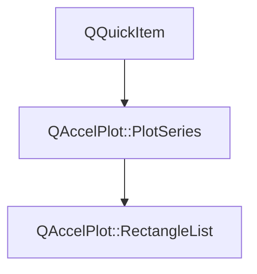

# Class QAccelPlot::RectangleList


[**ClassList**](annotated.md) **>** [**QAccelPlot**](namespaceQAccelPlot.md) **>** [**RectangleList**](classQAccelPlot_1_1RectangleList.md)


_A hardware-accelerated QML item that renders a large list of axis-aligned rectangles._ [More...](#detailed-description)

* `#include <RectangleList.hpp>`


Inherits the following classes: [QAccelPlot::PlotSeries](classQAccelPlot_1_1PlotSeries.md)


## Inheritance diagram




## Public Types inherited from QAccelPlot::PlotSeries

See [QAccelPlot::PlotSeries](classQAccelPlot_1_1PlotSeries.md)

| Type | Name |
| ---: | :--- |
| enum  | [**LegendSymbol**](classQAccelPlot_1_1PlotSeries.md#enum-legendsymbol)  <br>_Supported default legend symbols._  |


## Public Properties

| Type | Name |
| ---: | :--- |
| property QColor | [**color**](classQAccelPlot_1_1RectangleList.md#property-color-12)  <br>_Fill color applied to all rectangles. Default: semi-transparent blue._  |
| property int | [**count**](classQAccelPlot_1_1RectangleList.md#property-count-12)  <br>_Read-only: number of rectangles currently loaded._  |
| property int | [**hoveredIndex**](classQAccelPlot_1_1RectangleList.md#property-hoveredindex-12)  <br>_Read-only: index of the rectangle under the cursor, or -1 when none._  |


## Public Properties inherited from QAccelPlot::PlotSeries

See [QAccelPlot::PlotSeries](classQAccelPlot_1_1PlotSeries.md)

| Type | Name |
| ---: | :--- |
| property [**LegendSymbol**](classQAccelPlot_1_1PlotSeries.md#enum-legendsymbol) | [**legendSymbol**](classQAccelPlot_1_1PlotSeries.md#property-legendsymbol-12)  <br>_Symbol style requested from the default legend._  |
| property QString | [**name**](classQAccelPlot_1_1PlotSeries.md#property-name-12)  <br>_Identifying name used by the default legend._  |
| property QRectF | [**plotRect**](classQAccelPlot_1_1PlotSeries.md#property-plotrect-12)  <br>_Plot area in parent-item coordinates, assigned by_ `PlotView` _._ |
| property [**Axis**](classQAccelPlot_1_1Axis.md) \* | [**xAxis**](classQAccelPlot_1_1PlotSeries.md#property-xaxis-12)  <br>_Horizontal axis used for data-to-pixel coordinate mapping._  |
| property [**Axis**](classQAccelPlot_1_1Axis.md) \* | [**yAxis**](classQAccelPlot_1_1PlotSeries.md#property-yaxis-12)  <br>_Vertical axis used for data-to-pixel coordinate mapping._  |


## Public Signals

| Type | Name |
| ---: | :--- |
| signal void | [**colorChanged**](classQAccelPlot_1_1RectangleList.md#signal-colorchanged)  <br>_Emitted when the color property changes._  |
| signal void | [**countChanged**](classQAccelPlot_1_1RectangleList.md#signal-countchanged)  <br>_Emitted when the rectangle count changes._  |
| signal void | [**hoveredIndexChanged**](classQAccelPlot_1_1RectangleList.md#signal-hoveredindexchanged)  <br>_Emitted when the hovered rectangle index changes._  |


## Public Signals inherited from QAccelPlot::PlotSeries

See [QAccelPlot::PlotSeries](classQAccelPlot_1_1PlotSeries.md)

| Type | Name |
| ---: | :--- |
| signal void | [**legendSymbolChanged**](classQAccelPlot_1_1PlotSeries.md#signal-legendsymbolchanged)  <br> |
| signal void | [**nameChanged**](classQAccelPlot_1_1PlotSeries.md#signal-namechanged)  <br> |
| signal void | [**plotRectChanged**](classQAccelPlot_1_1PlotSeries.md#signal-plotrectchanged)  <br> |
| signal void | [**xAxisChanged**](classQAccelPlot_1_1PlotSeries.md#signal-xaxischanged)  <br> |
| signal void | [**xDataRangeChanged**](classQAccelPlot_1_1PlotSeries.md#signal-xdatarangechanged) (qreal min, qreal max) <br>_Emitted when the X data extent of this series changes._  |
| signal void | [**yAxisChanged**](classQAccelPlot_1_1PlotSeries.md#signal-yaxischanged)  <br> |
| signal void | [**yDataRangeChanged**](classQAccelPlot_1_1PlotSeries.md#signal-ydatarangechanged) (qreal min, qreal max) <br>_Emitted when the Y data extent of this series changes._  |


## Public Functions

| Type | Name |
| ---: | :--- |
|   | [**RectangleList**](#function-rectanglelist) (QQuickItem \* parent=nullptr) <br>_Constructs a_ [_**RectangleList**_](classQAccelPlot_1_1RectangleList.md) _with the given__parent_ _._ |
|  QColor | [**color**](#function-color-22) () const<br>_Returns the rectangle fill color._  |
|  int | [**count**](#function-count-22) () const<br>_Returns the number of rectangles currently loaded._  |
|  int | [**hoveredIndex**](#function-hoveredindex-22) () const<br>_Returns the index of the hovered rectangle, or -1 if none._  |
|  void | [**setColor**](#function-setcolor) (const QColor & color) <br>_Sets the fill color to_ _color_ _._ |
|  Q\_INVOKABLE void | [**setData**](#function-setdata) (const QVariantList & rects) <br>_Loads rectangles from_ _rects_ _, a QML list of objects with_`x1` _,_`y1` _,_`x2` _,_`y2` _properties._ |
|  void | [**setRawData**](#function-setrawdata) (const float \* data, int rectCount) <br>_Loads rectangles from a C++ raw float array (_ _data_ _must have__rectCount_ _× 4 floats: x1, y1, x2, y2)._ |


## Public Functions inherited from QAccelPlot::PlotSeries

See [QAccelPlot::PlotSeries](classQAccelPlot_1_1PlotSeries.md)

| Type | Name |
| ---: | :--- |
|   | [**PlotSeries**](classQAccelPlot_1_1PlotSeries.md#function-plotseries) (QQuickItem \* parent=nullptr) <br> |
|  [**LegendSymbol**](classQAccelPlot_1_1PlotSeries.md#enum-legendsymbol) | [**legendSymbol**](classQAccelPlot_1_1PlotSeries.md#function-legendsymbol-22) () const<br> |
|  QString | [**name**](classQAccelPlot_1_1PlotSeries.md#function-name-22) () const<br> |
|  QRectF | [**plotRect**](classQAccelPlot_1_1PlotSeries.md#function-plotrect-22) () const<br> |
|  void | [**setLegendSymbol**](classQAccelPlot_1_1PlotSeries.md#function-setlegendsymbol) ([**LegendSymbol**](classQAccelPlot_1_1PlotSeries.md#enum-legendsymbol) symbol) <br> |
|  void | [**setName**](classQAccelPlot_1_1PlotSeries.md#function-setname) (const QString & name) <br> |
|  void | [**setPlotRect**](classQAccelPlot_1_1PlotSeries.md#function-setplotrect) (const QRectF & rect) <br>_Updates the series geometry to exactly cover_ _rect_ _._ |
|  void | [**setXAxis**](classQAccelPlot_1_1PlotSeries.md#function-setxaxis) ([**Axis**](classQAccelPlot_1_1Axis.md) \* axis) <br> |
|  void | [**setYAxis**](classQAccelPlot_1_1PlotSeries.md#function-setyaxis) ([**Axis**](classQAccelPlot_1_1Axis.md) \* axis) <br> |
|  [**Axis**](classQAccelPlot_1_1Axis.md) \* | [**xAxis**](classQAccelPlot_1_1PlotSeries.md#function-xaxis-22) () const<br> |
|  [**Axis**](classQAccelPlot_1_1Axis.md) \* | [**yAxis**](classQAccelPlot_1_1PlotSeries.md#function-yaxis-22) () const<br> |


## Protected Functions

| Type | Name |
| ---: | :--- |
|  void | [**hoverLeaveEvent**](#function-hoverleaveevent) (QHoverEvent \* event) override<br> |
|  void | [**hoverMoveEvent**](#function-hovermoveevent) (QHoverEvent \* event) override<br> |
|  QSGNode \* | [**updatePaintNode**](#function-updatepaintnode) (QSGNode \* oldNode, UpdatePaintNodeData \*) override<br> |


## Protected Functions inherited from QAccelPlot::PlotSeries

See [QAccelPlot::PlotSeries](classQAccelPlot_1_1PlotSeries.md)

| Type | Name |
| ---: | :--- |
|  void | [**clearDataRanges**](classQAccelPlot_1_1PlotSeries.md#function-cleardataranges) () <br>_Clears cached extents after a series has been emptied._  |
|  void | [**setDataRanges**](classQAccelPlot_1_1PlotSeries.md#function-setdataranges) (qreal xMin, qreal xMax, qreal yMin, qreal yMax) <br>_Reports this series' data extents to its bound axes._  |


## Detailed Description


All rectangles are stored as interleaved floats (x1, y1, x2, y2) and uploaded to the GPU as a data texture, making it suitable for tens of thousands of rectangles. Hover detection uses an internal `SpatialGrid` for O(1) hit tests.


**See also:** [**LineCurve**](classQAccelPlot_1_1LineCurve.md), [**Axis**](classQAccelPlot_1_1Axis.md) 


    
## Public Properties Documentation


### property color {#property-color-12}

_Fill color applied to all rectangles. Default: semi-transparent blue._ 
```C++
QColor QAccelPlot::RectangleList::color;
```


<hr>


### property count {#property-count-12}

_Read-only: number of rectangles currently loaded._ 
```C++
int QAccelPlot::RectangleList::count;
```


<hr>


### property hoveredIndex {#property-hoveredindex-12}

_Read-only: index of the rectangle under the cursor, or -1 when none._ 
```C++
int QAccelPlot::RectangleList::hoveredIndex;
```


<hr>
## Public Signals Documentation


### signal colorChanged {#signal-colorchanged}

_Emitted when the color property changes._ 
```C++
void QAccelPlot::RectangleList::colorChanged;
```


<hr>


### signal countChanged {#signal-countchanged}

_Emitted when the rectangle count changes._ 
```C++
void QAccelPlot::RectangleList::countChanged;
```


<hr>


### signal hoveredIndexChanged {#signal-hoveredindexchanged}

_Emitted when the hovered rectangle index changes._ 
```C++
void QAccelPlot::RectangleList::hoveredIndexChanged;
```


<hr>
## Public Functions Documentation


### function RectangleList {#function-rectanglelist}

_Constructs a_ [_**RectangleList**_](classQAccelPlot_1_1RectangleList.md) _with the given__parent_ _._
```C++
explicit QAccelPlot::RectangleList::RectangleList (
    QQuickItem * parent=nullptr
) 
```


<hr>


### function color {#function-color-22}

_Returns the rectangle fill color._ 
```C++
QColor QAccelPlot::RectangleList::color () const
```


<hr>


### function count {#function-count-22}

_Returns the number of rectangles currently loaded._ 
```C++
int QAccelPlot::RectangleList::count () const
```


<hr>


### function hoveredIndex {#function-hoveredindex-22}

_Returns the index of the hovered rectangle, or -1 if none._ 
```C++
int QAccelPlot::RectangleList::hoveredIndex () const
```


<hr>


### function setColor {#function-setcolor}

_Sets the fill color to_ _color_ _._
```C++
void QAccelPlot::RectangleList::setColor (
    const QColor & color
) 
```


<hr>


### function setData {#function-setdata}

_Loads rectangles from_ _rects_ _, a QML list of objects with_`x1` _,_`y1` _,_`x2` _,_`y2` _properties._
```C++
Q_INVOKABLE void QAccelPlot::RectangleList::setData (
    const QVariantList & rects
) 
```


<hr>


### function setRawData {#function-setrawdata}

_Loads rectangles from a C++ raw float array (_ _data_ _must have__rectCount_ _× 4 floats: x1, y1, x2, y2)._
```C++
void QAccelPlot::RectangleList::setRawData (
    const float * data,
    int rectCount
) 
```


<hr>
## Protected Functions Documentation


### function hoverLeaveEvent {#function-hoverleaveevent}

```C++
void QAccelPlot::RectangleList::hoverLeaveEvent (
    QHoverEvent * event
) override
```


<hr>


### function hoverMoveEvent {#function-hovermoveevent}

```C++
void QAccelPlot::RectangleList::hoverMoveEvent (
    QHoverEvent * event
) override
```


<hr>


### function updatePaintNode {#function-updatepaintnode}

```C++
QSGNode * QAccelPlot::RectangleList::updatePaintNode (
    QSGNode * oldNode,
    UpdatePaintNodeData *
) override
```


<hr>

------------------------------
The documentation for this class was generated from the following file `QAccelPlot/src/shapes/RectangleList.hpp`

