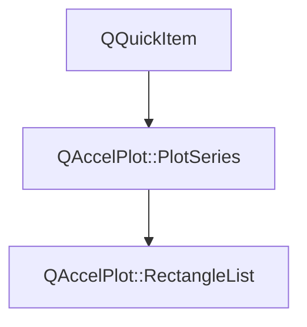

# Class QAccelPlot::RectangleList


[**ClassList**](annotated.md) **>** [**QAccelPlot**](namespaceQAccelPlot.md) **>** [**RectangleList**](classQAccelPlot_1_1RectangleList.md)


_A hardware-accelerated QML item that renders a large list of axis-aligned rectangles._ [More...](#detailed-description)

* `#include <RectangleList.hpp>`


Inherits the following classes: [QAccelPlot::PlotSeries](classQAccelPlot_1_1PlotSeries.md)


## Inheritance diagram


```mermaid
flowchart TB
  classQAccelPlot_1_1RectangleList["QAccelPlot::RectangleList"]

  classQAccelPlot_1_1PlotSeries["QAccelPlot::PlotSeries"]
  classQAccelPlot_1_1PlotSeries --> classQAccelPlot_1_1RectangleList
  click classQAccelPlot_1_1PlotSeries "../classQAccelPlot_1_1PlotSeries/" "Open QAccelPlot::PlotSeries"

  external_base_classQAccelPlot_1_1PlotSeries_1["QQuickItem"]
  external_base_classQAccelPlot_1_1PlotSeries_1 --> classQAccelPlot_1_1PlotSeries

```


## Public Types inherited from QAccelPlot::PlotSeries

See [QAccelPlot::PlotSeries](classQAccelPlot_1_1PlotSeries.md)

| Type | Name |
| ---: | :--- |
| enum  | [**LegendSymbol**](classQAccelPlot_1_1PlotSeries.md#enum-legendsymbol)  <br>_Supported default legend symbols._  |
| enum  | [**MarkerShape**](classQAccelPlot_1_1PlotSeries.md#enum-markershape)  <br>_Marker shapes shared by every series that draws markers._  |


## Public Properties

| Type | Name |
| ---: | :--- |
| property [**RectangleBorder**](classQAccelPlot_1_1RectangleBorder.md) \* | [**border**](classQAccelPlot_1_1RectangleList.md#property-border-12)  <br>_Grouped outline settings, e.g._ `border.width` _and_`border.color` _. No outline by default._ |
| property QList&lt; QColor &gt; | [**categoryColors**](classQAccelPlot_1_1RectangleList.md#property-categorycolors-12)  <br>_Fill colors indexed by each rectangle's_ `category` _. Default: empty._ |
| property QColor | [**color**](classQAccelPlot_1_1RectangleList.md#property-color-12)  <br>_Fill color of rectangles without a category color. Default:_ `Colors.dark.seriesPrimary` _with alpha 50._ |
| property int | [**count**](classQAccelPlot_1_1RectangleList.md#property-count-12)  <br>_Read-only: number of rectangles currently loaded._  |
| property QColor | [**hoverColor**](classQAccelPlot_1_1RectangleList.md#property-hovercolor-12)  <br>_Fill color of the rectangle under the cursor. Default: an invalid color, no highlight._  |
| property int | [**hoveredIndex**](classQAccelPlot_1_1RectangleList.md#property-hoveredindex-12)  <br>_Read-only: index of the rectangle under the cursor, or -1 when none._  |
| property qreal | [**minimumHeight**](classQAccelPlot_1_1RectangleList.md#property-minimumheight-12)  <br>_Minimum drawn height in pixels, like_ `minimumWidth` _. Default: 1._ |
| property qreal | [**minimumWidth**](classQAccelPlot_1_1RectangleList.md#property-minimumwidth-12)  <br>_Minimum drawn width in pixels, so narrow rectangles stay visible when zoomed out. Default: 1._  |


## Public Properties inherited from QAccelPlot::PlotSeries

See [QAccelPlot::PlotSeries](classQAccelPlot_1_1PlotSeries.md)

| Type | Name |
| ---: | :--- |
| property [**LegendSymbol**](classQAccelPlot_1_1PlotSeries.md#enum-legendsymbol) | [**legendSymbol**](classQAccelPlot_1_1PlotSeries.md#property-legendsymbol-12)  <br>_Symbol style requested from the default legend._  |
| property QString | [**name**](classQAccelPlot_1_1PlotSeries.md#property-name-12)  <br>_Identifying name used by the default legend._  |
| property QRectF | [**plotRect**](classQAccelPlot_1_1PlotSeries.md#property-plotrect-12)  <br>_Plot area in parent-item coordinates, assigned by_ `PlotView` _._ |
| property [**Axis**](classQAccelPlot_1_1Axis.md) \* | [**xAxis**](classQAccelPlot_1_1PlotSeries.md#property-xaxis-12)  <br>_Horizontal axis used for data-to-pixel coordinate mapping._  |
| property [**Axis**](classQAccelPlot_1_1Axis.md) \* | [**yAxis**](classQAccelPlot_1_1PlotSeries.md#property-yaxis-12)  <br>_Vertical axis used for data-to-pixel coordinate mapping._  |


## Public Signals

| Type | Name |
| ---: | :--- |
| signal void | [**categoryColorsChanged**](classQAccelPlot_1_1RectangleList.md#signal-categorycolorschanged)  <br>_Emitted when the categoryColors property changes._  |
| signal void | [**colorChanged**](classQAccelPlot_1_1RectangleList.md#signal-colorchanged)  <br>_Emitted when the color property changes._  |
| signal void | [**countChanged**](classQAccelPlot_1_1RectangleList.md#signal-countchanged)  <br>_Emitted when the rectangle count changes._  |
| signal void | [**hoverColorChanged**](classQAccelPlot_1_1RectangleList.md#signal-hovercolorchanged)  <br>_Emitted when the hoverColor property changes._  |
| signal void | [**hoveredIndexChanged**](classQAccelPlot_1_1RectangleList.md#signal-hoveredindexchanged)  <br>_Emitted when the hovered rectangle index changes._  |
| signal void | [**minimumHeightChanged**](classQAccelPlot_1_1RectangleList.md#signal-minimumheightchanged)  <br>_Emitted when the minimumHeight property changes._  |
| signal void | [**minimumWidthChanged**](classQAccelPlot_1_1RectangleList.md#signal-minimumwidthchanged)  <br>_Emitted when the minimumWidth property changes._  |


## Public Signals inherited from QAccelPlot::PlotSeries

See [QAccelPlot::PlotSeries](classQAccelPlot_1_1PlotSeries.md)

| Type | Name |
| ---: | :--- |
| signal void | [**legendSymbolChanged**](classQAccelPlot_1_1PlotSeries.md#signal-legendsymbolchanged)  <br> |
| signal void | [**nameChanged**](classQAccelPlot_1_1PlotSeries.md#signal-namechanged)  <br> |
| signal void | [**plotRectChanged**](classQAccelPlot_1_1PlotSeries.md#signal-plotrectchanged)  <br> |
| signal void | [**xAxisChanged**](classQAccelPlot_1_1PlotSeries.md#signal-xaxischanged)  <br> |
| signal void | [**xDataRangeChanged**](classQAccelPlot_1_1PlotSeries.md#signal-xdatarangechanged) (qreal min, qreal max) <br>_Emitted when the X data extent of this series changes._  |
| signal void | [**yAxisChanged**](classQAccelPlot_1_1PlotSeries.md#signal-yaxischanged)  <br> |
| signal void | [**yDataRangeChanged**](classQAccelPlot_1_1PlotSeries.md#signal-ydatarangechanged) (qreal min, qreal max) <br>_Emitted when the Y data extent of this series changes._  |


## Public Functions

| Type | Name |
| ---: | :--- |
|   | [**RectangleList**](#function-rectanglelist) (QQuickItem \* parent=nullptr) <br>_Constructs a_ [_**RectangleList**_](classQAccelPlot_1_1RectangleList.md) _with the given__parent_ _._ |
|  [**RectangleBorder**](classQAccelPlot_1_1RectangleBorder.md) \* | [**border**](#function-border-22) () const<br>_Returns the grouped outline settings. The object is owned by the list._  |
|  QList&lt; QColor &gt; | [**categoryColors**](#function-categorycolors-22) () const<br>_Returns the fill colors indexed by category._  |
|  Q\_INVOKABLE void | [**clearData**](#function-cleardata) () <br>_Removes all rectangles._  |
|  QColor | [**color**](#function-color-22) () const<br>_Returns the rectangle fill color._  |
|  bool | [**contains**](#function-contains) (const QPointF & point) override const<br>_Returns_ `true` _when a rectangle lies under item position__point_ _._ |
|  int | [**count**](#function-count-22) () const<br>_Returns the number of rectangles currently loaded._  |
|  QColor | [**hoverColor**](#function-hovercolor-22) () const<br>_Returns the fill color of the hovered rectangle._  |
|  int | [**hoveredIndex**](#function-hoveredindex-22) () const<br>_Returns the index of the hovered rectangle, or -1 if none._  |
|  qreal | [**minimumHeight**](#function-minimumheight-22) () const<br>_Returns the minimum drawn height in pixels._  |
|  qreal | [**minimumWidth**](#function-minimumwidth-22) () const<br>_Returns the minimum drawn width in pixels._  |
|  void | [**postData**](#function-postdata-14) (std::vector&lt; double &gt; && data, int rectCount) <br>_Thread-safe: queues_ `setData` _(__data_ _,__rectCount_ _) to the item's thread._ |
|  void | [**postData**](#function-postdata-24) (std::vector&lt; double &gt; && data, std::vector&lt; int &gt; && categories, int rectCount) <br>_Thread-safe: queues_ `setData` _(__data_ _,__categories_ _,__rectCount_ _) to the item's thread._ |
|  void | [**postData**](#function-postdata-34) (std::vector&lt; float &gt; && data, int rectCount) <br>_Thread-safe: queues_ `setDataF` _(__data_ _,__rectCount_ _) to the item's thread._ |
|  void | [**postData**](#function-postdata-44) (std::vector&lt; float &gt; && data, std::vector&lt; int &gt; && categories, int rectCount) <br>_Thread-safe: queues_ `setDataF` _(__data_ _,__categories_ _,__rectCount_ _) to the item's thread._ |
|  Q\_INVOKABLE QVariantMap | [**rectangleAt**](#function-rectangleat) (int index) const<br>_Returns rectangle_ _index_ _as an object with_`x1` _,_`y1` _,_`x2` _,_`y2` _properties._ |
|  int | [**rectangleIndexAt**](#function-rectangleindexat) (const QPointF & position) const<br>_Returns the index of the topmost rectangle under item position_ _position_ _, or -1._ |
|  Q\_INVOKABLE void | [**setCategories**](#function-setcategories) (const QList&lt; int &gt; & categories) <br>_Sets one category per rectangle. An empty list clears categories; any other size must equal_ `count` _._ |
|  void | [**setCategoryColors**](#function-setcategorycolors) (const QList&lt; QColor &gt; & colors) <br>_Sets the fill colors indexed by category to_ _colors_ _._ |
|  void | [**setColor**](#function-setcolor) (const QColor & color) <br>_Sets the fill color to_ _color_ _._ |
|  Q\_INVOKABLE void | [**setData**](#function-setdata-14) (const QVariantList & rects) <br>_Loads rectangles from_ _rects_ _, a QML list of objects with_`x1` _,_`y1` _,_`x2` _,_`y2` _properties._ |
|  void | [**setData**](#function-setdata-24) (const double \* data, int rectCount) <br>_Loads rectangles from a C++ raw double array, preserving full precision for large coordinates (e.g. modern Unix-epoch timestamps)._ _data_ _must have__rectCount_ _× 4 doubles._ |
|  void | [**setData**](#function-setdata-34) (std::vector&lt; double &gt; && data, int rectCount) <br>_Moves_ _data_ _(__rectCount_ _× 4 doubles: x1, y1, x2, y2) into the list and clears categories. No copy is made._ |
|  void | [**setData**](#function-setdata-44) (std::vector&lt; double &gt; && data, std::vector&lt; int &gt; && categories, int rectCount) <br>_Moves_ _data_ _and per-rectangle__categories_ _(empty, or exactly__rectCount_ _) into the list._ |
|  void | [**setDataF**](#function-setdataf-13) (const float \* data, int rectCount) <br>_High-performance C++ overload: copies_ _rectCount_ _× 4 floats (x1, y1, x2, y2) from__data_ _and clears categories._ |
|  void | [**setDataF**](#function-setdataf-23) (std::vector&lt; float &gt; && data, int rectCount) <br>_High-performance C++ overload: moves_ _data_ _(__rectCount_ _× 4 floats) into the list and clears categories._ |
|  void | [**setDataF**](#function-setdataf-33) (std::vector&lt; float &gt; && data, std::vector&lt; int &gt; && categories, int rectCount) <br>_Like_ `setDataF` _(__data_ _,__rectCount_ _) and also moves per-rectangle__categories_ _(empty, or exactly__rectCount_ _) into the list._ |
|  void | [**setDataFNoRange**](#function-setdatafnorange-13) (std::vector&lt; float &gt; && data, int rectCount) <br>_Like_ `setDataF()` _but does not report X/Y data ranges to the axes._ |
|  void | [**setDataFNoRange**](#function-setdatafnorange-23) (std::vector&lt; float &gt; && data, std::vector&lt; int &gt; && categories, int rectCount) <br>_Like_ `setDataFNoRange` _(__data_ _,__rectCount_ _) and also moves per-rectangle__categories_ _into the list._ |
|  void | [**setDataFNoRange**](#function-setdatafnorange-33) (const float \* data, int rectCount) <br>_Like_ `setDataFNoRange(vector)` _but copies from a raw float array into the list's reusable buffer._ |
|  void | [**setDataNoRange**](#function-setdatanorange-12) (std::vector&lt; double &gt; && data, int rectCount) <br>_Like_ `setData()` _but does not report X/Y data ranges to the axes._ |
|  void | [**setDataNoRange**](#function-setdatanorange-22) (std::vector&lt; double &gt; && data, std::vector&lt; int &gt; && categories, int rectCount) <br>_Like_ `setDataNoRange` _(__data_ _,__rectCount_ _) and also moves per-rectangle__categories_ _into the list._ |
|  void | [**setHoverColor**](#function-sethovercolor) (const QColor & color) <br>_Sets the fill color of the hovered rectangle to_ _color_ _. An invalid color disables the highlight._ |
|  void | [**setMinimumHeight**](#function-setminimumheight) (qreal height) <br>_Sets the minimum drawn height to_ _height_ _pixels. Negative values are clamped to 0._ |
|  void | [**setMinimumWidth**](#function-setminimumwidth) (qreal width) <br>_Sets the minimum drawn width to_ _width_ _pixels. Negative values are clamped to 0._ |


## Public Functions inherited from QAccelPlot::PlotSeries

See [QAccelPlot::PlotSeries](classQAccelPlot_1_1PlotSeries.md)

| Type | Name |
| ---: | :--- |
|   | [**PlotSeries**](classQAccelPlot_1_1PlotSeries.md#function-plotseries) (QQuickItem \* parent=nullptr) <br> |
|  [**LegendSymbol**](classQAccelPlot_1_1PlotSeries.md#enum-legendsymbol) | [**legendSymbol**](classQAccelPlot_1_1PlotSeries.md#function-legendsymbol-22) () const<br> |
|  QString | [**name**](classQAccelPlot_1_1PlotSeries.md#function-name-22) () const<br> |
|  QRectF | [**plotRect**](classQAccelPlot_1_1PlotSeries.md#function-plotrect-22) () const<br> |
|  void | [**setLegendSymbol**](classQAccelPlot_1_1PlotSeries.md#function-setlegendsymbol) ([**LegendSymbol**](classQAccelPlot_1_1PlotSeries.md#enum-legendsymbol) symbol) <br> |
|  void | [**setName**](classQAccelPlot_1_1PlotSeries.md#function-setname) (const QString & name) <br> |
|  void | [**setPlotRect**](classQAccelPlot_1_1PlotSeries.md#function-setplotrect) (const QRectF & rect) <br>_Updates the series geometry to exactly cover_ _rect_ _._ |
|  void | [**setXAxis**](classQAccelPlot_1_1PlotSeries.md#function-setxaxis) ([**Axis**](classQAccelPlot_1_1Axis.md) \* axis) <br> |
|  void | [**setYAxis**](classQAccelPlot_1_1PlotSeries.md#function-setyaxis) ([**Axis**](classQAccelPlot_1_1Axis.md) \* axis) <br> |
|  [**Axis**](classQAccelPlot_1_1Axis.md) \* | [**xAxis**](classQAccelPlot_1_1PlotSeries.md#function-xaxis-22) () const<br> |
|  [**Axis**](classQAccelPlot_1_1Axis.md) \* | [**yAxis**](classQAccelPlot_1_1PlotSeries.md#function-yaxis-22) () const<br> |


## Protected Functions

| Type | Name |
| ---: | :--- |
|  void | [**hoverEnterEvent**](#function-hoverenterevent) (QHoverEvent \* event) override<br> |
|  void | [**hoverLeaveEvent**](#function-hoverleaveevent) (QHoverEvent \* event) override<br> |
|  void | [**hoverMoveEvent**](#function-hovermoveevent) (QHoverEvent \* event) override<br> |
| virtual void | [**onAxisScaleChanged**](#function-onaxisscalechanged) () override<br>_Invalidates uploaded coordinates when an axis changes scale._  |
|  QSGNode \* | [**updatePaintNode**](#function-updatepaintnode) (QSGNode \* oldNode, UpdatePaintNodeData \*) override<br> |


## Protected Functions inherited from QAccelPlot::PlotSeries

See [QAccelPlot::PlotSeries](classQAccelPlot_1_1PlotSeries.md)

| Type | Name |
| ---: | :--- |
|  void | [**clearDataRanges**](classQAccelPlot_1_1PlotSeries.md#function-cleardataranges) () <br>_Clears cached extents after a series has been emptied._  |
|  void | [**clearXDataRange**](classQAccelPlot_1_1PlotSeries.md#function-clearxdatarange) () <br>_Clears the cached X extent, e.g. when no sample has a valid X coordinate._  |
|  void | [**clearYDataRange**](classQAccelPlot_1_1PlotSeries.md#function-clearydatarange) () <br>_Clears the cached Y extent, e.g. when no sample has a valid Y coordinate._  |
|  void | [**extendXDataRange**](classQAccelPlot_1_1PlotSeries.md#function-extendxdatarange) (qreal x) <br>_Widens the reported X extent to include_ _x_ _._ |
|  void | [**extendYDataRange**](classQAccelPlot_1_1PlotSeries.md#function-extendydatarange) (qreal y) <br>_Widens the reported Y extent to include_ _y_ _. A non-finite__y_ _leaves the extent unchanged._ |
| virtual void | [**onAxisScaleChanged**](classQAccelPlot_1_1PlotSeries.md#function-onaxisscalechanged) () <br>_Called when a bound axis switches between linear and logarithmic scale, or a different axis is bound._  |
|  QRectF | [**resolvePlotRect**](classQAccelPlot_1_1PlotSeries.md#function-resolveplotrect) () const<br>_Returns the plot area to render into:_ `plotRect` _when set, otherwise the item's current size._ |
|  void | [**setDataRanges**](classQAccelPlot_1_1PlotSeries.md#function-setdataranges) (qreal xMin, qreal xMax, qreal yMin, qreal yMax) <br>_Reports this series' data extents to its bound axes._  |
|  void | [**setXDataRange**](classQAccelPlot_1_1PlotSeries.md#function-setxdatarange) (qreal min, qreal max) <br>_Reports this series' X data extent to its bound horizontal axis. Non-finite extents are ignored._  |
|  void | [**setYDataRange**](classQAccelPlot_1_1PlotSeries.md#function-setydatarange) (qreal min, qreal max) <br>_Reports this series' Y data extent to its bound vertical axis. Non-finite extents are ignored._  |
|  std::optional&lt; [**DataExtent**](structQAccelPlot_1_1PlotSeries_1_1DataExtent.md) &gt; | [**xDataRange**](classQAccelPlot_1_1PlotSeries.md#function-xdatarange) () const<br>_Returns this series' X data range, or_ `std::nullopt` _when it has none._ |
|  std::optional&lt; [**DataExtent**](structQAccelPlot_1_1PlotSeries_1_1DataExtent.md) &gt; | [**yDataRange**](classQAccelPlot_1_1PlotSeries.md#function-ydatarange) () const<br>_Returns this series' Y data range, or_ `std::nullopt` _when it has none._ |


## Detailed Description


Rectangles are stored as interleaved (x1, y1, x2, y2) values and uploaded to the GPU as a float data texture, making it suitable for millions of rectangles. The `setData()` overloads keep doubles and upload them relative to an origin near the data, so large coordinates such as epoch timestamps stay precise. The `setDataF()` overloads store floats and upload them without conversion. Hover detection uses an internal `SpatialGrid` for O(1) hit tests.


An infinite edge extends the rectangle to the plot edge, e.g. `y1` = -Infinity and `y2` = +Infinity for a full-height span. Infinite edges don't affect the axes' data ranges. Rectangles with a NaN edge are not drawn or hovered.


Each rectangle can carry a `category`, an index into `categoryColors`. Rectangles without a category, or with one outside `categoryColors`, use `color`.


**
**

Up to 16,777,216 (2^24) rectangles are drawn correctly. The shader indexes rectangles in single precision, and at that count the data texture reaches 8192 rows, the size every GPU supports.


**See also:** [**LineCurve**](classQAccelPlot_1_1LineCurve.md), [**Axis**](classQAccelPlot_1_1Axis.md) 


    
## Public Properties Documentation


### property border {#property-border-12}

_Grouped outline settings, e.g._ `border.width` _and_`border.color` _. No outline by default._
```C++
RectangleBorder* QAccelPlot::RectangleList::border;
```


<hr>


### property categoryColors {#property-categorycolors-12}

_Fill colors indexed by each rectangle's_ `category` _. Default: empty._
```C++
QList<QColor> QAccelPlot::RectangleList::categoryColors;
```


<hr>


### property color {#property-color-12}

_Fill color of rectangles without a category color. Default:_ `Colors.dark.seriesPrimary` _with alpha 50._
```C++
QColor QAccelPlot::RectangleList::color;
```


<hr>


### property count {#property-count-12}

_Read-only: number of rectangles currently loaded._ 
```C++
int QAccelPlot::RectangleList::count;
```


<hr>


### property hoverColor {#property-hovercolor-12}

_Fill color of the rectangle under the cursor. Default: an invalid color, no highlight._ 
```C++
QColor QAccelPlot::RectangleList::hoverColor;
```


<hr>


### property hoveredIndex {#property-hoveredindex-12}

_Read-only: index of the rectangle under the cursor, or -1 when none._ 
```C++
int QAccelPlot::RectangleList::hoveredIndex;
```


<hr>


### property minimumHeight {#property-minimumheight-12}

_Minimum drawn height in pixels, like_ `minimumWidth` _. Default: 1._
```C++
qreal QAccelPlot::RectangleList::minimumHeight;
```


<hr>


### property minimumWidth {#property-minimumwidth-12}

_Minimum drawn width in pixels, so narrow rectangles stay visible when zoomed out. Default: 1._ 
```C++
qreal QAccelPlot::RectangleList::minimumWidth;
```


Narrower rectangles are widened around their center. Hover uses the widened size. Clamped to at least 0. 


        

<hr>
## Public Signals Documentation


### signal categoryColorsChanged {#signal-categorycolorschanged}

_Emitted when the categoryColors property changes._ 
```C++
void QAccelPlot::RectangleList::categoryColorsChanged;
```


<hr>


### signal colorChanged {#signal-colorchanged}

_Emitted when the color property changes._ 
```C++
void QAccelPlot::RectangleList::colorChanged;
```


<hr>


### signal countChanged {#signal-countchanged}

_Emitted when the rectangle count changes._ 
```C++
void QAccelPlot::RectangleList::countChanged;
```


<hr>


### signal hoverColorChanged {#signal-hovercolorchanged}

_Emitted when the hoverColor property changes._ 
```C++
void QAccelPlot::RectangleList::hoverColorChanged;
```


<hr>


### signal hoveredIndexChanged {#signal-hoveredindexchanged}

_Emitted when the hovered rectangle index changes._ 
```C++
void QAccelPlot::RectangleList::hoveredIndexChanged;
```


<hr>


### signal minimumHeightChanged {#signal-minimumheightchanged}

_Emitted when the minimumHeight property changes._ 
```C++
void QAccelPlot::RectangleList::minimumHeightChanged;
```


<hr>


### signal minimumWidthChanged {#signal-minimumwidthchanged}

_Emitted when the minimumWidth property changes._ 
```C++
void QAccelPlot::RectangleList::minimumWidthChanged;
```


<hr>
## Public Functions Documentation


### function RectangleList {#function-rectanglelist}

_Constructs a_ [_**RectangleList**_](classQAccelPlot_1_1RectangleList.md) _with the given__parent_ _._
```C++
explicit QAccelPlot::RectangleList::RectangleList (
    QQuickItem * parent=nullptr
) 
```


<hr>


### function border {#function-border-22}

_Returns the grouped outline settings. The object is owned by the list._ 
```C++
RectangleBorder * QAccelPlot::RectangleList::border () const
```


<hr>


### function categoryColors {#function-categorycolors-22}

_Returns the fill colors indexed by category._ 
```C++
QList< QColor > QAccelPlot::RectangleList::categoryColors () const
```


<hr>


### function clearData {#function-cleardata}

_Removes all rectangles._ 
```C++
Q_INVOKABLE void QAccelPlot::RectangleList::clearData () 
```


<hr>


### function color {#function-color-22}

_Returns the rectangle fill color._ 
```C++
QColor QAccelPlot::RectangleList::color () const
```


<hr>


### function contains {#function-contains}

_Returns_ `true` _when a rectangle lies under item position__point_ _._
```C++
bool QAccelPlot::RectangleList::contains (
    const QPointF & point
) override const
```


Hover delivery uses this test, so stacked series underneath still receive hover events outside this list's rectangles. 


        

<hr>


### function count {#function-count-22}

_Returns the number of rectangles currently loaded._ 
```C++
int QAccelPlot::RectangleList::count () const
```


<hr>


### function hoverColor {#function-hovercolor-22}

_Returns the fill color of the hovered rectangle._ 
```C++
QColor QAccelPlot::RectangleList::hoverColor () const
```


<hr>


### function hoveredIndex {#function-hoveredindex-22}

_Returns the index of the hovered rectangle, or -1 if none._ 
```C++
int QAccelPlot::RectangleList::hoveredIndex () const
```


<hr>


### function minimumHeight {#function-minimumheight-22}

_Returns the minimum drawn height in pixels._ 
```C++
qreal QAccelPlot::RectangleList::minimumHeight () const
```


<hr>


### function minimumWidth {#function-minimumwidth-22}

_Returns the minimum drawn width in pixels._ 
```C++
qreal QAccelPlot::RectangleList::minimumWidth () const
```


<hr>


### function postData {#function-postdata-14}

_Thread-safe: queues_ `setData` _(__data_ _,__rectCount_ _) to the item's thread._
```C++
void QAccelPlot::RectangleList::postData (
    std::vector< double > && data,
    int rectCount
) 
```


<hr>


### function postData {#function-postdata-24}

_Thread-safe: queues_ `setData` _(__data_ _,__categories_ _,__rectCount_ _) to the item's thread._
```C++
void QAccelPlot::RectangleList::postData (
    std::vector< double > && data,
    std::vector< int > && categories,
    int rectCount
) 
```


<hr>


### function postData {#function-postdata-34}

_Thread-safe: queues_ `setDataF` _(__data_ _,__rectCount_ _) to the item's thread._
```C++
void QAccelPlot::RectangleList::postData (
    std::vector< float > && data,
    int rectCount
) 
```


<hr>


### function postData {#function-postdata-44}

_Thread-safe: queues_ `setDataF` _(__data_ _,__categories_ _,__rectCount_ _) to the item's thread._
```C++
void QAccelPlot::RectangleList::postData (
    std::vector< float > && data,
    std::vector< int > && categories,
    int rectCount
) 
```


<hr>


### function rectangleAt {#function-rectangleat}

_Returns rectangle_ _index_ _as an object with_`x1` _,_`y1` _,_`x2` _,_`y2` _properties._
```C++
Q_INVOKABLE QVariantMap QAccelPlot::RectangleList::rectangleAt (
    int index
) const
```


Includes `category` when categories are set. Returns an empty object when _index_ is out of range. 


        

<hr>


### function rectangleIndexAt {#function-rectangleindexat}

_Returns the index of the topmost rectangle under item position_ _position_ _, or -1._
```C++
int QAccelPlot::RectangleList::rectangleIndexAt (
    const QPointF & position
) const
```


<hr>


### function setCategories {#function-setcategories}

_Sets one category per rectangle. An empty list clears categories; any other size must equal_ `count` _._
```C++
Q_INVOKABLE void QAccelPlot::RectangleList::setCategories (
    const QList< int > & categories
) 
```


<hr>


### function setCategoryColors {#function-setcategorycolors}

_Sets the fill colors indexed by category to_ _colors_ _._
```C++
void QAccelPlot::RectangleList::setCategoryColors (
    const QList< QColor > & colors
) 
```


<hr>


### function setColor {#function-setcolor}

_Sets the fill color to_ _color_ _._
```C++
void QAccelPlot::RectangleList::setColor (
    const QColor & color
) 
```


<hr>


### function setData {#function-setdata-14}

_Loads rectangles from_ _rects_ _, a QML list of objects with_`x1` _,_`y1` _,_`x2` _,_`y2` _properties._
```C++
Q_INVOKABLE void QAccelPlot::RectangleList::setData (
    const QVariantList & rects
) 
```


A missing or null `x1` / `y1` is -Infinity and a missing `x2` / `y2` is +Infinity, so `{ x1: 8, x2: 12 }` is a full-height span. An optional integer `category` selects the fill color from `categoryColors`. 


        

<hr>


### function setData {#function-setdata-24}

_Loads rectangles from a C++ raw double array, preserving full precision for large coordinates (e.g. modern Unix-epoch timestamps)._ _data_ _must have__rectCount_ _× 4 doubles._
```C++
void QAccelPlot::RectangleList::setData (
    const double * data,
    int rectCount
) 
```


<hr>


### function setData {#function-setdata-34}

_Moves_ _data_ _(__rectCount_ _× 4 doubles: x1, y1, x2, y2) into the list and clears categories. No copy is made._
```C++
void QAccelPlot::RectangleList::setData (
    std::vector< double > && data,
    int rectCount
) 
```


<hr>


### function setData {#function-setdata-44}

_Moves_ _data_ _and per-rectangle__categories_ _(empty, or exactly__rectCount_ _) into the list._
```C++
void QAccelPlot::RectangleList::setData (
    std::vector< double > && data,
    std::vector< int > && categories,
    int rectCount
) 
```


<hr>


### function setDataF {#function-setdataf-13}

_High-performance C++ overload: copies_ _rectCount_ _× 4 floats (x1, y1, x2, y2) from__data_ _and clears categories._
```C++
void QAccelPlot::RectangleList::setDataF (
    const float * data,
    int rectCount
) 
```


<hr>


### function setDataF {#function-setdataf-23}

_High-performance C++ overload: moves_ _data_ _(__rectCount_ _× 4 floats) into the list and clears categories._
```C++
void QAccelPlot::RectangleList::setDataF (
    std::vector< float > && data,
    int rectCount
) 
```


<hr>


### function setDataF {#function-setdataf-33}

_Like_ `setDataF` _(__data_ _,__rectCount_ _) and also moves per-rectangle__categories_ _(empty, or exactly__rectCount_ _) into the list._
```C++
void QAccelPlot::RectangleList::setDataF (
    std::vector< float > && data,
    std::vector< int > && categories,
    int rectCount
) 
```


<hr>


### function setDataFNoRange {#function-setdatafnorange-13}

_Like_ `setDataF()` _but does not report X/Y data ranges to the axes._
```C++
void QAccelPlot::RectangleList::setDataFNoRange (
    std::vector< float > && data,
    int rectCount
) 
```


Use it for streaming when the axes' `dataMin` / `dataMax` are managed by the application. 


        

<hr>


### function setDataFNoRange {#function-setdatafnorange-23}

_Like_ `setDataFNoRange` _(__data_ _,__rectCount_ _) and also moves per-rectangle__categories_ _into the list._
```C++
void QAccelPlot::RectangleList::setDataFNoRange (
    std::vector< float > && data,
    std::vector< int > && categories,
    int rectCount
) 
```


<hr>


### function setDataFNoRange {#function-setdatafnorange-33}

_Like_ `setDataFNoRange(vector)` _but copies from a raw float array into the list's reusable buffer._
```C++
void QAccelPlot::RectangleList::setDataFNoRange (
    const float * data,
    int rectCount
) 
```


<hr>


### function setDataNoRange {#function-setdatanorange-12}

_Like_ `setData()` _but does not report X/Y data ranges to the axes._
```C++
void QAccelPlot::RectangleList::setDataNoRange (
    std::vector< double > && data,
    int rectCount
) 
```


Use it for streaming when the axes' `dataMin` / `dataMax` are managed by the application. 


        

<hr>


### function setDataNoRange {#function-setdatanorange-22}

_Like_ `setDataNoRange` _(__data_ _,__rectCount_ _) and also moves per-rectangle__categories_ _into the list._
```C++
void QAccelPlot::RectangleList::setDataNoRange (
    std::vector< double > && data,
    std::vector< int > && categories,
    int rectCount
) 
```


<hr>


### function setHoverColor {#function-sethovercolor}

_Sets the fill color of the hovered rectangle to_ _color_ _. An invalid color disables the highlight._
```C++
void QAccelPlot::RectangleList::setHoverColor (
    const QColor & color
) 
```


<hr>


### function setMinimumHeight {#function-setminimumheight}

_Sets the minimum drawn height to_ _height_ _pixels. Negative values are clamped to 0._
```C++
void QAccelPlot::RectangleList::setMinimumHeight (
    qreal height
) 
```


<hr>


### function setMinimumWidth {#function-setminimumwidth}

_Sets the minimum drawn width to_ _width_ _pixels. Negative values are clamped to 0._
```C++
void QAccelPlot::RectangleList::setMinimumWidth (
    qreal width
) 
```


<hr>
## Protected Functions Documentation


### function hoverEnterEvent {#function-hoverenterevent}

```C++
void QAccelPlot::RectangleList::hoverEnterEvent (
    QHoverEvent * event
) override
```


<hr>


### function hoverLeaveEvent {#function-hoverleaveevent}

```C++
void QAccelPlot::RectangleList::hoverLeaveEvent (
    QHoverEvent * event
) override
```


<hr>


### function hoverMoveEvent {#function-hovermoveevent}

```C++
void QAccelPlot::RectangleList::hoverMoveEvent (
    QHoverEvent * event
) override
```


<hr>


### function onAxisScaleChanged {#function-onaxisscalechanged}

_Invalidates uploaded coordinates when an axis changes scale._ 
```C++
virtual void QAccelPlot::RectangleList::onAxisScaleChanged () override
```


Implements [*QAccelPlot::PlotSeries::onAxisScaleChanged*](classQAccelPlot_1_1PlotSeries.md#function-onaxisscalechanged)


<hr>


### function updatePaintNode {#function-updatepaintnode}

```C++
QSGNode * QAccelPlot::RectangleList::updatePaintNode (
    QSGNode * oldNode,
    UpdatePaintNodeData *
) override
```


<hr>

------------------------------
The documentation for this class was generated from the following file `QAccelPlot/src/QAccelPlot/series/RectangleList.hpp`

