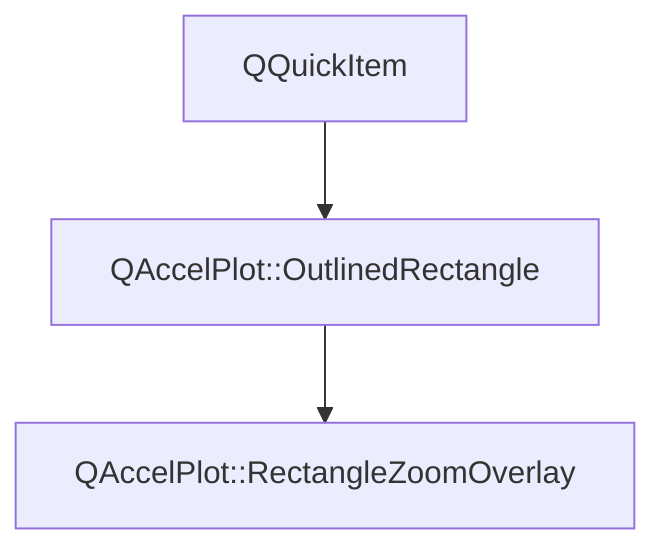

# Class QAccelPlot::RectangleZoomOverlay


[**ClassList**](annotated.md) **>** [**QAccelPlot**](namespaceQAccelPlot.md) **>** [**RectangleZoomOverlay**](classQAccelPlot_1_1RectangleZoomOverlay.md)


Inherits the following classes: [QAccelPlot::OutlinedRectangle](classQAccelPlot_1_1OutlinedRectangle.md)


## Inheritance diagram




## Public Functions

| Type | Name |
| ---: | :--- |
|   | [**RectangleZoomOverlay**](#function-rectanglezoomoverlay) (QQuickItem \* parent, [**PlotRectangleZoom**](classQAccelPlot_1_1PlotRectangleZoom.md) \* configuration) <br> |


## Public Functions inherited from QAccelPlot::OutlinedRectangle

See [QAccelPlot::OutlinedRectangle](classQAccelPlot_1_1OutlinedRectangle.md)

| Type | Name |
| ---: | :--- |
|   | [**OutlinedRectangle**](classQAccelPlot_1_1OutlinedRectangle.md#function-outlinedrectangle) (QQuickItem \* parent=nullptr) <br> |
|  void | [**setColors**](classQAccelPlot_1_1OutlinedRectangle.md#function-setcolors) (const QColor & fill, const QColor & border) <br>_Sets the_ _fill_ _and__border_ _colors._ |


## Protected Functions inherited from QAccelPlot::OutlinedRectangle

See [QAccelPlot::OutlinedRectangle](classQAccelPlot_1_1OutlinedRectangle.md)

| Type | Name |
| ---: | :--- |
|  QSGNode \* | [**updatePaintNode**](classQAccelPlot_1_1OutlinedRectangle.md#function-updatepaintnode) (QSGNode \* oldNode, UpdatePaintNodeData \*) override<br> |


## Public Functions Documentation


### function RectangleZoomOverlay {#function-rectanglezoomoverlay}

```C++
QAccelPlot::RectangleZoomOverlay::RectangleZoomOverlay (
    QQuickItem * parent,
    PlotRectangleZoom * configuration
) 
```


<hr>

------------------------------
The documentation for this class was generated from the following file `QAccelPlot/src/QAccelPlot/internal/RectangleZoomOverlay.hpp`

