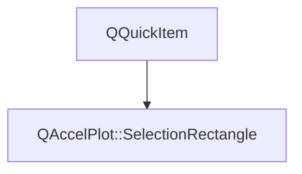

# Class QAccelPlot::SelectionRectangle


[**ClassList**](annotated.md) **>** [**QAccelPlot**](namespaceQAccelPlot.md) **>** [**SelectionRectangle**](classQAccelPlot_1_1SelectionRectangle.md)


_Draws the gesture or the selected region of a_ [_**SelectionTool**_](classQAccelPlot_1_1SelectionTool.md) _, clipped to the plot area._[More...](#detailed-description)

* `#include <SelectionRectangle.hpp>`


Inherits the following classes: QQuickItem


## Inheritance diagram




## Public Functions

| Type | Name |
| ---: | :--- |
|   | [**SelectionRectangle**](#function-selectionrectangle) ([**SelectionTool**](classQAccelPlot_1_1SelectionTool.md) & tool) <br> |


## Detailed Description


The item lives in the overlay of the tool's plot, below the overlay's other children, and is owned by the tool. 


    
## Public Functions Documentation


### function SelectionRectangle {#function-selectionrectangle}

```C++
explicit QAccelPlot::SelectionRectangle::SelectionRectangle (
    SelectionTool & tool
) 
```


<hr>

------------------------------
The documentation for this class was generated from the following file `QAccelPlot/src/QAccelPlot/inspection/internal/SelectionRectangle.hpp`

