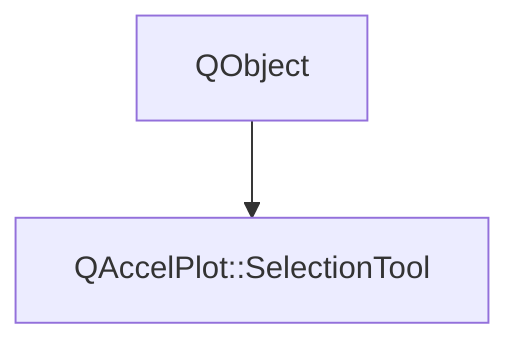

# Class QAccelPlot::SelectionTool


[**ClassList**](annotated.md) **>** [**QAccelPlot**](namespaceQAccelPlot.md) **>** [**SelectionTool**](classQAccelPlot_1_1SelectionTool.md)


_Selects a data-space region by dragging, without changing the plot viewport._ [More...](#detailed-description)

* `#include <SelectionTool.hpp>`


Inherits the following classes: QObject


## Inheritance diagram




## Public Types

| Type | Name |
| ---: | :--- |
| enum  | [**Mode**](#enum-mode)  <br>_Region selected by a gesture._  |


## Public Properties

| Type | Name |
| ---: | :--- |
| property QColor | [**borderColor**](classQAccelPlot_1_1SelectionTool.md#property-bordercolor-12)  <br>_Outline color of the rectangle. Default:_ `Colors.dark.selectionBorder` _._ |
| property int | [**button**](classQAccelPlot_1_1SelectionTool.md#property-button-12)  <br>_Mouse button that starts a gesture. Default: Qt.LeftButton._  |
| property bool | [**enabled**](classQAccelPlot_1_1SelectionTool.md#property-enabled-12)  <br>_Enables gestures; disabling cancels a gesture in progress and keeps the selection. Default: true._  |
| property QColor | [**fillColor**](classQAccelPlot_1_1SelectionTool.md#property-fillcolor-12)  <br>_Fill color of the rectangle. Default:_ `Colors.dark.selectionFill` _._ |
| property bool | [**hasSelection**](classQAccelPlot_1_1SelectionTool.md#property-hasselection-12)  <br>_True while a region is selected._  |
| property qreal | [**minimumSize**](classQAccelPlot_1_1SelectionTool.md#property-minimumsize-12)  <br>_Smallest gesture in logical pixels that selects; a smaller one only clears the selection. Default: 6._  |
| property [**Mode**](classQAccelPlot_1_1SelectionTool.md#enum-mode) | [**mode**](classQAccelPlot_1_1SelectionTool.md#property-mode-12)  <br>_Region a gesture selects: a box, an X range, or a Y range. Default: Box._  |
| property [**QAccelPlot::InspectionRowModel**](classQAccelPlot_1_1InspectionRowModel.md) \* | [**model**](classQAccelPlot_1_1SelectionTool.md#property-model-12)  <br>_Read-only constant: one row of region statistics per selected series._  |
| property int | [**modifiers**](classQAccelPlot_1_1SelectionTool.md#property-modifiers-12)  <br>_Exact Qt::KeyboardModifiers required at press time. Default: Qt.ShiftModifier._  |
| property QRectF | [**pixelRect**](classQAccelPlot_1_1SelectionTool.md#property-pixelrect-12)  <br>_Gesture or selected region in plot-local logical pixels; empty without either._  |
| property [**QAccelPlot::QAccelPlot**](classQAccelPlot_1_1QAccelPlot.md) \* | [**plot**](classQAccelPlot_1_1SelectionTool.md#property-plot-12)  <br>_Plot receiving the selection gestures._  |
| property bool | [**rectangleVisible**](classQAccelPlot_1_1SelectionTool.md#property-rectanglevisible-12)  <br>_Draws the gesture and the selected region. Disable it to draw_ `pixelRect` _yourself. Default: true._ |
| property bool | [**selecting**](classQAccelPlot_1_1SelectionTool.md#property-selecting-12)  <br>_True while a gesture is in progress._  |
| property [**QAccelPlot::Axis**](classQAccelPlot_1_1Axis.md) \* | [**xAxis**](classQAccelPlot_1_1SelectionTool.md#property-xaxis-12)  <br>[_**Axis**_](classQAccelPlot_1_1Axis.md) _the X limits refer to; unset uses the plot's primary X axis._ |
| property qreal | [**xMax**](classQAccelPlot_1_1SelectionTool.md#property-xmax-12)  <br>_Upper X limit of the selection; Infinity when unbounded, NaN without a selection._  |
| property qreal | [**xMin**](classQAccelPlot_1_1SelectionTool.md#property-xmin-12)  <br>_Lower X limit of the selection; -Infinity when unbounded, NaN without a selection._  |
| property [**QAccelPlot::Axis**](classQAccelPlot_1_1Axis.md) \* | [**yAxis**](classQAccelPlot_1_1SelectionTool.md#property-yaxis-12)  <br>[_**Axis**_](classQAccelPlot_1_1Axis.md) _the Y limits refer to; unset uses the plot's primary Y axis._ |
| property qreal | [**yMax**](classQAccelPlot_1_1SelectionTool.md#property-ymax-12)  <br>_Upper Y limit of the selection; Infinity when unbounded, NaN without a selection._  |
| property qreal | [**yMin**](classQAccelPlot_1_1SelectionTool.md#property-ymin-12)  <br>_Lower Y limit of the selection; -Infinity when unbounded, NaN without a selection._  |


## Public Signals

| Type | Name |
| ---: | :--- |
| signal void | [**borderColorChanged**](classQAccelPlot_1_1SelectionTool.md#signal-bordercolorchanged)  <br>_Emitted when the borderColor property changes._  |
| signal void | [**buttonChanged**](classQAccelPlot_1_1SelectionTool.md#signal-buttonchanged)  <br>_Emitted when the button property changes._  |
| signal void | [**completed**](classQAccelPlot_1_1SelectionTool.md#signal-completed)  <br>_Emitted when a gesture selected a region. Rows of series that are still preparing follow later._  |
| signal void | [**enabledChanged**](classQAccelPlot_1_1SelectionTool.md#signal-enabledchanged)  <br>_Emitted when the enabled property changes._  |
| signal void | [**fillColorChanged**](classQAccelPlot_1_1SelectionTool.md#signal-fillcolorchanged)  <br>_Emitted when the fillColor property changes._  |
| signal void | [**minimumSizeChanged**](classQAccelPlot_1_1SelectionTool.md#signal-minimumsizechanged)  <br>_Emitted when the minimumSize property changes._  |
| signal void | [**modeChanged**](classQAccelPlot_1_1SelectionTool.md#signal-modechanged)  <br>_Emitted when the mode property changes._  |
| signal void | [**modifiersChanged**](classQAccelPlot_1_1SelectionTool.md#signal-modifierschanged)  <br>_Emitted when the modifiers property changes._  |
| signal void | [**pixelRectChanged**](classQAccelPlot_1_1SelectionTool.md#signal-pixelrectchanged)  <br>_Emitted when the pixelRect property changes._  |
| signal void | [**plotChanged**](classQAccelPlot_1_1SelectionTool.md#signal-plotchanged)  <br>_Emitted when the plot property changes._  |
| signal void | [**rectangleVisibleChanged**](classQAccelPlot_1_1SelectionTool.md#signal-rectanglevisiblechanged)  <br>_Emitted when the rectangleVisible property changes._  |
| signal void | [**selectingChanged**](classQAccelPlot_1_1SelectionTool.md#signal-selectingchanged)  <br>_Emitted when a gesture starts or ends._  |
| signal void | [**selectionChanged**](classQAccelPlot_1_1SelectionTool.md#signal-selectionchanged)  <br>_Emitted when the selected region is set, changed, or cleared._  |
| signal void | [**xAxisChanged**](classQAccelPlot_1_1SelectionTool.md#signal-xaxischanged)  <br>_Emitted when the axis the X limits refer to changes._  |
| signal void | [**yAxisChanged**](classQAccelPlot_1_1SelectionTool.md#signal-yaxischanged)  <br>_Emitted when the axis the Y limits refer to changes._  |


## Public Functions

| Type | Name |
| ---: | :--- |
|   | [**SelectionTool**](#function-selectiontool) (QObject \* parent=nullptr) <br>_Constructs a tool without a plot._  |
|  QColor | [**borderColor**](#function-bordercolor-22) () const<br>_Returns the rectangle's outline color._  |
|  int | [**button**](#function-button-22) () const<br>_Returns the mouse button that starts a gesture._  |
|  Q\_INVOKABLE void | [**clear**](#function-clear) () <br>_Cancels a gesture in progress and clears the selection._  |
|  bool | [**enabled**](#function-enabled-22) () const<br>_Returns whether gestures are enabled._  |
|  QColor | [**fillColor**](#function-fillcolor-22) () const<br>_Returns the rectangle's fill color._  |
|  bool | [**hasSelection**](#function-hasselection-22) () const<br>_Returns true while a region is selected._  |
|  Q\_INVOKABLE::QAccelPlot::InspectionPage | [**indices**](#function-indices) ([**::QAccelPlot::PlotSeries**](classQAccelPlot_1_1PlotSeries.md) \* series, int offset=0, int limit=4096) <br>_Returns one page of_ _series'_ _source indices inside the selection, against its current data._ |
|  qreal | [**minimumSize**](#function-minimumsize-22) () const<br>_Returns the smallest selecting gesture in logical pixels._  |
|  [**Mode**](classQAccelPlot_1_1SelectionTool.md#enum-mode) | [**mode**](#function-mode-22) () const<br>_Returns the region a gesture selects._  |
|  [**InspectionRowModel**](classQAccelPlot_1_1InspectionRowModel.md) \* | [**model**](#function-model-22) () const<br>_Returns the model of per-series region statistics._  |
|  int | [**modifiers**](#function-modifiers-22) () const<br>_Returns the required keyboard modifiers._  |
|  QRectF | [**pixelRect**](#function-pixelrect-22) () const<br>_Returns the gesture or selected region in plot-local logical pixels._  |
|  [**::QAccelPlot::QAccelPlot**](classQAccelPlot_1_1QAccelPlot.md) \* | [**plot**](#function-plot-22) () const<br>_Returns the attached plot._  |
|  bool | [**rectangleVisible**](#function-rectanglevisible-22) () const<br>_Returns whether the tool draws its rectangle._  |
|  Q\_INVOKABLE bool | [**select**](#function-select) (qreal xMin, qreal xMax, qreal yMin, qreal yMax) <br>_Selects the region with the given limits; returns false when a limit is NaN._  |
|  bool | [**selecting**](#function-selecting-22) () const<br>_Returns true while a gesture is in progress._  |
|  void | [**setBorderColor**](#function-setbordercolor) (const QColor & color) <br>_Sets the rectangle's outline color._  |
|  void | [**setButton**](#function-setbutton) (int button) <br>_Sets the mouse button that starts a gesture._  |
|  void | [**setEnabled**](#function-setenabled) (bool enabled) <br>_Enables or disables gestures._  |
|  void | [**setFillColor**](#function-setfillcolor) (const QColor & color) <br>_Sets the rectangle's fill color._  |
|  void | [**setMinimumSize**](#function-setminimumsize) (qreal size) <br>_Sets the smallest selecting gesture, clamping negative values to zero and ignoring nonfinite values._  |
|  void | [**setMode**](#function-setmode) ([**Mode**](classQAccelPlot_1_1SelectionTool.md#enum-mode) mode) <br>_Sets the region a gesture selects and cancels a gesture in progress._  |
|  void | [**setModifiers**](#function-setmodifiers) (int modifiers) <br>_Sets the exact keyboard modifiers required at press time._  |
|  void | [**setPlot**](#function-setplot) ([**::QAccelPlot::QAccelPlot**](classQAccelPlot_1_1QAccelPlot.md) \* plot) <br>_Attaches to_ _plot_ _and clears the selection._ |
|  void | [**setRectangleVisible**](#function-setrectanglevisible) (bool visible) <br>_Shows or hides the tool's rectangle._  |
|  void | [**setXAxis**](#function-setxaxis) ([**Axis**](classQAccelPlot_1_1Axis.md) \* axis) <br>_Sets the X axis and clears the selection; null uses the plot's primary X axis._  |
|  void | [**setYAxis**](#function-setyaxis) ([**Axis**](classQAccelPlot_1_1Axis.md) \* axis) <br>_Sets the Y axis and clears the selection; null uses the plot's primary Y axis._  |
|  [**Axis**](classQAccelPlot_1_1Axis.md) \* | [**xAxis**](#function-xaxis-22) () const<br>_Returns the axis the X limits refer to._  |
|  qreal | [**xMax**](#function-xmax-22) () const<br>_Returns the upper X limit of the selection._  |
|  qreal | [**xMin**](#function-xmin-22) () const<br>_Returns the lower X limit of the selection._  |
|  [**Axis**](classQAccelPlot_1_1Axis.md) \* | [**yAxis**](#function-yaxis-22) () const<br>_Returns the axis the Y limits refer to._  |
|  qreal | [**yMax**](#function-ymax-22) () const<br>_Returns the upper Y limit of the selection._  |
|  qreal | [**yMin**](#function-ymin-22) () const<br>_Returns the lower Y limit of the selection._  |


## Detailed Description


The tool draws the gesture and the selected region in the plot's overlay, below the overlay's other children. The region is kept in data coordinates, so it follows panning and zooming and survives data updates: the model rows are recomputed whenever a series changes. An infinite limit leaves that side of the region unbounded, as a range selection does for its other dimension.


**See also:** [**SeriesInspection**](classQAccelPlot_1_1SeriesInspection.md), [**InspectionRowModel**](classQAccelPlot_1_1InspectionRowModel.md) 


    
## Public Types Documentation


### enum Mode {#enum-mode}

_Region selected by a gesture._ 
```C++
enum QAccelPlot::SelectionTool::Mode {
    Box,
    XRange,
    YRange
};
```


<hr>
## Public Properties Documentation


### property borderColor {#property-bordercolor-12}

_Outline color of the rectangle. Default:_ `Colors.dark.selectionBorder` _._
```C++
QColor QAccelPlot::SelectionTool::borderColor;
```


<hr>


### property button {#property-button-12}

_Mouse button that starts a gesture. Default: Qt.LeftButton._ 
```C++
int QAccelPlot::SelectionTool::button;
```


<hr>


### property enabled {#property-enabled-12}

_Enables gestures; disabling cancels a gesture in progress and keeps the selection. Default: true._ 
```C++
bool QAccelPlot::SelectionTool::enabled;
```


<hr>


### property fillColor {#property-fillcolor-12}

_Fill color of the rectangle. Default:_ `Colors.dark.selectionFill` _._
```C++
QColor QAccelPlot::SelectionTool::fillColor;
```


<hr>


### property hasSelection {#property-hasselection-12}

_True while a region is selected._ 
```C++
bool QAccelPlot::SelectionTool::hasSelection;
```


<hr>


### property minimumSize {#property-minimumsize-12}

_Smallest gesture in logical pixels that selects; a smaller one only clears the selection. Default: 6._ 
```C++
qreal QAccelPlot::SelectionTool::minimumSize;
```


<hr>


### property mode {#property-mode-12}

_Region a gesture selects: a box, an X range, or a Y range. Default: Box._ 
```C++
Mode QAccelPlot::SelectionTool::mode;
```


<hr>


### property model {#property-model-12}

_Read-only constant: one row of region statistics per selected series._ 
```C++
QAccelPlot::InspectionRowModel* QAccelPlot::SelectionTool::model;
```


<hr>


### property modifiers {#property-modifiers-12}

_Exact Qt::KeyboardModifiers required at press time. Default: Qt.ShiftModifier._ 
```C++
int QAccelPlot::SelectionTool::modifiers;
```


<hr>


### property pixelRect {#property-pixelrect-12}

_Gesture or selected region in plot-local logical pixels; empty without either._ 
```C++
QRectF QAccelPlot::SelectionTool::pixelRect;
```


<hr>


### property plot {#property-plot-12}

_Plot receiving the selection gestures._ 
```C++
QAccelPlot::QAccelPlot* QAccelPlot::SelectionTool::plot;
```


<hr>


### property rectangleVisible {#property-rectanglevisible-12}

_Draws the gesture and the selected region. Disable it to draw_ `pixelRect` _yourself. Default: true._
```C++
bool QAccelPlot::SelectionTool::rectangleVisible;
```


<hr>


### property selecting {#property-selecting-12}

_True while a gesture is in progress._ 
```C++
bool QAccelPlot::SelectionTool::selecting;
```


<hr>


### property xAxis {#property-xaxis-12}

[_**Axis**_](classQAccelPlot_1_1Axis.md) _the X limits refer to; unset uses the plot's primary X axis._
```C++
QAccelPlot::Axis* QAccelPlot::SelectionTool::xAxis;
```


<hr>


### property xMax {#property-xmax-12}

_Upper X limit of the selection; Infinity when unbounded, NaN without a selection._ 
```C++
qreal QAccelPlot::SelectionTool::xMax;
```


<hr>


### property xMin {#property-xmin-12}

_Lower X limit of the selection; -Infinity when unbounded, NaN without a selection._ 
```C++
qreal QAccelPlot::SelectionTool::xMin;
```


<hr>


### property yAxis {#property-yaxis-12}

[_**Axis**_](classQAccelPlot_1_1Axis.md) _the Y limits refer to; unset uses the plot's primary Y axis._
```C++
QAccelPlot::Axis* QAccelPlot::SelectionTool::yAxis;
```


<hr>


### property yMax {#property-ymax-12}

_Upper Y limit of the selection; Infinity when unbounded, NaN without a selection._ 
```C++
qreal QAccelPlot::SelectionTool::yMax;
```


<hr>


### property yMin {#property-ymin-12}

_Lower Y limit of the selection; -Infinity when unbounded, NaN without a selection._ 
```C++
qreal QAccelPlot::SelectionTool::yMin;
```


<hr>
## Public Signals Documentation


### signal borderColorChanged {#signal-bordercolorchanged}

_Emitted when the borderColor property changes._ 
```C++
void QAccelPlot::SelectionTool::borderColorChanged;
```


<hr>


### signal buttonChanged {#signal-buttonchanged}

_Emitted when the button property changes._ 
```C++
void QAccelPlot::SelectionTool::buttonChanged;
```


<hr>


### signal completed {#signal-completed}

_Emitted when a gesture selected a region. Rows of series that are still preparing follow later._ 
```C++
void QAccelPlot::SelectionTool::completed;
```


<hr>


### signal enabledChanged {#signal-enabledchanged}

_Emitted when the enabled property changes._ 
```C++
void QAccelPlot::SelectionTool::enabledChanged;
```


<hr>


### signal fillColorChanged {#signal-fillcolorchanged}

_Emitted when the fillColor property changes._ 
```C++
void QAccelPlot::SelectionTool::fillColorChanged;
```


<hr>


### signal minimumSizeChanged {#signal-minimumsizechanged}

_Emitted when the minimumSize property changes._ 
```C++
void QAccelPlot::SelectionTool::minimumSizeChanged;
```


<hr>


### signal modeChanged {#signal-modechanged}

_Emitted when the mode property changes._ 
```C++
void QAccelPlot::SelectionTool::modeChanged;
```


<hr>


### signal modifiersChanged {#signal-modifierschanged}

_Emitted when the modifiers property changes._ 
```C++
void QAccelPlot::SelectionTool::modifiersChanged;
```


<hr>


### signal pixelRectChanged {#signal-pixelrectchanged}

_Emitted when the pixelRect property changes._ 
```C++
void QAccelPlot::SelectionTool::pixelRectChanged;
```


<hr>


### signal plotChanged {#signal-plotchanged}

_Emitted when the plot property changes._ 
```C++
void QAccelPlot::SelectionTool::plotChanged;
```


<hr>


### signal rectangleVisibleChanged {#signal-rectanglevisiblechanged}

_Emitted when the rectangleVisible property changes._ 
```C++
void QAccelPlot::SelectionTool::rectangleVisibleChanged;
```


<hr>


### signal selectingChanged {#signal-selectingchanged}

_Emitted when a gesture starts or ends._ 
```C++
void QAccelPlot::SelectionTool::selectingChanged;
```


<hr>


### signal selectionChanged {#signal-selectionchanged}

_Emitted when the selected region is set, changed, or cleared._ 
```C++
void QAccelPlot::SelectionTool::selectionChanged;
```


<hr>


### signal xAxisChanged {#signal-xaxischanged}

_Emitted when the axis the X limits refer to changes._ 
```C++
void QAccelPlot::SelectionTool::xAxisChanged;
```


<hr>


### signal yAxisChanged {#signal-yaxischanged}

_Emitted when the axis the Y limits refer to changes._ 
```C++
void QAccelPlot::SelectionTool::yAxisChanged;
```


<hr>
## Public Functions Documentation


### function SelectionTool {#function-selectiontool}

_Constructs a tool without a plot._ 
```C++
explicit QAccelPlot::SelectionTool::SelectionTool (
    QObject * parent=nullptr
) 
```


<hr>


### function borderColor {#function-bordercolor-22}

_Returns the rectangle's outline color._ 
```C++
QColor QAccelPlot::SelectionTool::borderColor () const
```


<hr>


### function button {#function-button-22}

_Returns the mouse button that starts a gesture._ 
```C++
int QAccelPlot::SelectionTool::button () const
```


<hr>


### function clear {#function-clear}

_Cancels a gesture in progress and clears the selection._ 
```C++
Q_INVOKABLE void QAccelPlot::SelectionTool::clear () 
```


<hr>


### function enabled {#function-enabled-22}

_Returns whether gestures are enabled._ 
```C++
bool QAccelPlot::SelectionTool::enabled () const
```


<hr>


### function fillColor {#function-fillcolor-22}

_Returns the rectangle's fill color._ 
```C++
QColor QAccelPlot::SelectionTool::fillColor () const
```


<hr>


### function hasSelection {#function-hasselection-22}

_Returns true while a region is selected._ 
```C++
bool QAccelPlot::SelectionTool::hasSelection () const
```


<hr>


### function indices {#function-indices}

_Returns one page of_ _series'_ _source indices inside the selection, against its current data._
```C++
Q_INVOKABLE::QAccelPlot::InspectionPage QAccelPlot::SelectionTool::indices (
    ::QAccelPlot::PlotSeries * series,
    int offset=0,
    int limit=4096
) 
```


<hr>


### function minimumSize {#function-minimumsize-22}

_Returns the smallest selecting gesture in logical pixels._ 
```C++
qreal QAccelPlot::SelectionTool::minimumSize () const
```


<hr>


### function mode {#function-mode-22}

_Returns the region a gesture selects._ 
```C++
Mode QAccelPlot::SelectionTool::mode () const
```


<hr>


### function model {#function-model-22}

_Returns the model of per-series region statistics._ 
```C++
InspectionRowModel * QAccelPlot::SelectionTool::model () const
```


<hr>


### function modifiers {#function-modifiers-22}

_Returns the required keyboard modifiers._ 
```C++
int QAccelPlot::SelectionTool::modifiers () const
```


<hr>


### function pixelRect {#function-pixelrect-22}

_Returns the gesture or selected region in plot-local logical pixels._ 
```C++
QRectF QAccelPlot::SelectionTool::pixelRect () const
```


<hr>


### function plot {#function-plot-22}

_Returns the attached plot._ 
```C++
::QAccelPlot::QAccelPlot * QAccelPlot::SelectionTool::plot () const
```


<hr>


### function rectangleVisible {#function-rectanglevisible-22}

_Returns whether the tool draws its rectangle._ 
```C++
bool QAccelPlot::SelectionTool::rectangleVisible () const
```


<hr>


### function select {#function-select}

_Selects the region with the given limits; returns false when a limit is NaN._ 
```C++
Q_INVOKABLE bool QAccelPlot::SelectionTool::select (
    qreal xMin,
    qreal xMax,
    qreal yMin,
    qreal yMax
) 
```


<hr>


### function selecting {#function-selecting-22}

_Returns true while a gesture is in progress._ 
```C++
bool QAccelPlot::SelectionTool::selecting () const
```


<hr>


### function setBorderColor {#function-setbordercolor}

_Sets the rectangle's outline color._ 
```C++
void QAccelPlot::SelectionTool::setBorderColor (
    const QColor & color
) 
```


<hr>


### function setButton {#function-setbutton}

_Sets the mouse button that starts a gesture._ 
```C++
void QAccelPlot::SelectionTool::setButton (
    int button
) 
```


<hr>


### function setEnabled {#function-setenabled}

_Enables or disables gestures._ 
```C++
void QAccelPlot::SelectionTool::setEnabled (
    bool enabled
) 
```


<hr>


### function setFillColor {#function-setfillcolor}

_Sets the rectangle's fill color._ 
```C++
void QAccelPlot::SelectionTool::setFillColor (
    const QColor & color
) 
```


<hr>


### function setMinimumSize {#function-setminimumsize}

_Sets the smallest selecting gesture, clamping negative values to zero and ignoring nonfinite values._ 
```C++
void QAccelPlot::SelectionTool::setMinimumSize (
    qreal size
) 
```


<hr>


### function setMode {#function-setmode}

_Sets the region a gesture selects and cancels a gesture in progress._ 
```C++
void QAccelPlot::SelectionTool::setMode (
    Mode mode
) 
```


<hr>


### function setModifiers {#function-setmodifiers}

_Sets the exact keyboard modifiers required at press time._ 
```C++
void QAccelPlot::SelectionTool::setModifiers (
    int modifiers
) 
```


<hr>


### function setPlot {#function-setplot}

_Attaches to_ _plot_ _and clears the selection._
```C++
void QAccelPlot::SelectionTool::setPlot (
    ::QAccelPlot::QAccelPlot * plot
) 
```


<hr>


### function setRectangleVisible {#function-setrectanglevisible}

_Shows or hides the tool's rectangle._ 
```C++
void QAccelPlot::SelectionTool::setRectangleVisible (
    bool visible
) 
```


<hr>


### function setXAxis {#function-setxaxis}

_Sets the X axis and clears the selection; null uses the plot's primary X axis._ 
```C++
void QAccelPlot::SelectionTool::setXAxis (
    Axis * axis
) 
```


<hr>


### function setYAxis {#function-setyaxis}

_Sets the Y axis and clears the selection; null uses the plot's primary Y axis._ 
```C++
void QAccelPlot::SelectionTool::setYAxis (
    Axis * axis
) 
```


<hr>


### function xAxis {#function-xaxis-22}

_Returns the axis the X limits refer to._ 
```C++
Axis * QAccelPlot::SelectionTool::xAxis () const
```


<hr>


### function xMax {#function-xmax-22}

_Returns the upper X limit of the selection._ 
```C++
qreal QAccelPlot::SelectionTool::xMax () const
```


<hr>


### function xMin {#function-xmin-22}

_Returns the lower X limit of the selection._ 
```C++
qreal QAccelPlot::SelectionTool::xMin () const
```


<hr>


### function yAxis {#function-yaxis-22}

_Returns the axis the Y limits refer to._ 
```C++
Axis * QAccelPlot::SelectionTool::yAxis () const
```


<hr>


### function yMax {#function-ymax-22}

_Returns the upper Y limit of the selection._ 
```C++
qreal QAccelPlot::SelectionTool::yMax () const
```


<hr>


### function yMin {#function-ymin-22}

_Returns the lower Y limit of the selection._ 
```C++
qreal QAccelPlot::SelectionTool::yMin () const
```


<hr>

------------------------------
The documentation for this class was generated from the following file `QAccelPlot/src/QAccelPlot/inspection/SelectionTool.hpp`

