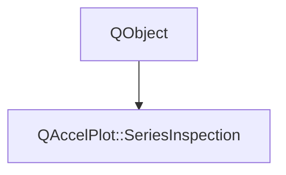

# Class QAccelPlot::SeriesInspection


[**ClassList**](annotated.md) **>** [**QAccelPlot**](namespaceQAccelPlot.md) **>** [**SeriesInspection**](classQAccelPlot_1_1SeriesInspection.md)


_Data queries for one series: nearest samples, brackets, region statistics, and index pages._ [More...](#detailed-description)

* `#include <SeriesInspection.hpp>`


Inherits the following classes: QObject


## Inheritance diagram




## Public Properties

| Type | Name |
| ---: | :--- |
| property int | [**maximumPageSize**](classQAccelPlot_1_1SeriesInspection.md#property-maximumpagesize-12)  <br>_Largest page returned by_ `indices()` _._ |
| property QML\_ANONYMOUSQAccelPlot::InspectionNS::Status | [**status**](classQAccelPlot_1_1SeriesInspection.md#property-status-12)  <br>_Readiness for sample queries:_ `Ready` _,_`Idle` _,_`Preparing` _,_`Unsupported` _, or_`Unavailable` _._ |
| property bool | [**supported**](classQAccelPlot_1_1SeriesInspection.md#property-supported-12)  <br>_Whether the series has XY records that sample queries can search._  |


## Public Signals

| Type | Name |
| ---: | :--- |
| signal void | [**statusChanged**](classQAccelPlot_1_1SeriesInspection.md#signal-statuschanged)  <br>_Emitted when the readiness may have changed: after a data change, and when an index is ready._  |


## Public Functions

| Type | Name |
| ---: | :--- |
|  Q\_INVOKABLE::QAccelPlot::InspectionBracket | [**bracketByX**](#function-bracketbyx) (qreal pixelX) <br>_Returns the valid samples on either side of_ _pixelX_ _and the point between them._ |
|  Q\_INVOKABLE::QAccelPlot::InspectionBracket | [**bracketByY**](#function-bracketbyy) (qreal pixelY) <br>_Returns the valid samples whose Y is on either side of_ _pixelY_ _and the point between them._ |
|  Q\_INVOKABLE quint64 | [**indexBytes**](#function-indexbytes) () const<br>_Returns the bytes held by query caches and indexes, excluding the series' own data._  |
|  Q\_INVOKABLE::QAccelPlot::InspectionPage | [**indices**](#function-indices) (qreal xMin, qreal xMax, qreal yMin, qreal yMax, int offset=0, int limit=4096, quint64 expectedRevision=0) <br>_Returns up to_ _limit_ _source indices inside the region, skipping the first__offset_ _matches._ |
|  int | [**maximumPageSize**](#function-maximumpagesize-22) () const<br>_Returns the largest page returned by_ `indices()` _._ |
|  Q\_INVOKABLE::QAccelPlot::InspectionSample | [**nearest**](#function-nearest) (const QPointF & position, qreal radius=10) <br>_Returns the valid sample nearest to_ _position_ _within__radius_ _pixels on screen._ |
|  Q\_INVOKABLE::QAccelPlot::InspectionSample | [**nearestByX**](#function-nearestbyx) (qreal pixelX, qreal radius=std::numeric\_limits&lt; qreal &gt;::infinity()) <br>_Returns the valid sample nearest to_ _pixelX_ _horizontally, within__radius_ _pixels._ |
|  Q\_INVOKABLE::QAccelPlot::InspectionSample | [**nearestByY**](#function-nearestbyy) (qreal pixelY, qreal radius=std::numeric\_limits&lt; qreal &gt;::infinity()) <br>_Returns the valid sample nearest to_ _pixelY_ _vertically, within__radius_ _pixels._ |
|  Q\_INVOKABLE void | [**prepare**](#function-prepare) () <br>_Starts building a query index when the series needs one; otherwise does nothing._  |
|  Q\_INVOKABLE::QAccelPlot::InspectionRecord | [**recordAt**](#function-recordat) (int index) const<br>_Returns the native record at_ _index_ _of a bar, rectangle, or band series._ |
|  Q\_INVOKABLE::QAccelPlot::InspectionRecord | [**recordAtPosition**](#function-recordatposition) (const QPointF & position) const<br>_Returns the native record drawn at the series-local_ _position_ _._ |
|  Q\_INVOKABLE::QAccelPlot::InspectionSample | [**sampleAt**](#function-sampleat) (int index) const<br>_Returns the record at_ _index_ _;_`NoMatch` _with its raw coordinates when the record is invalid._ |
|  [**InspectionStatus**](namespaceQAccelPlot_1_1InspectionNS.md#enum-status) | [**status**](#function-status-22) () const<br>_Returns the readiness for sample queries._  |
|  Q\_INVOKABLE::QAccelPlot::InspectionSummary | [**summarize**](#function-summarize) (qreal xMin, qreal xMax, qreal yMin, qreal yMax) <br>_Returns Y statistics of the valid samples inside the region._  |
|  Q\_INVOKABLE::QAccelPlot::InspectionSummary | [**summarizeRange**](#function-summarizerange) (qreal xMin, qreal xMax) <br>_Returns Y statistics of the valid samples whose X lies in the interval._  |
|  bool | [**supported**](#function-supported-22) () const<br>_Returns whether the series has XY records that sample queries can search._  |
|   | [**~SeriesInspection**](#function-seriesinspection) () override<br> |


## Detailed Description


Available as `PlotSeries::inspection`. Call it on the series' thread. Pixel arguments are series-local logical pixels; regions are inclusive data-space limits, where an infinite limit leaves that side unbounded and reversed limits are swapped.


`LineCurve` and `PointCloud` answer every query. Series whose X or Y values are finite and non-decreasing are searched in place, need no preparation, and stay queryable while records are appended; queries along one axis, such as `nearestByX()`, need that order along their own axis. Other series above a small size are indexed on a worker thread first; until then queries return `Inspection.Preparing`. Other series types expose native records through `recordAt()` and `recordAtPosition()` only.


**See also:** [**PlotInspector**](classQAccelPlot_1_1PlotInspector.md), [**SelectionTool**](classQAccelPlot_1_1SelectionTool.md) 


    
## Public Properties Documentation


### property maximumPageSize {#property-maximumpagesize-12}

_Largest page returned by_ `indices()` _._
```C++
int QAccelPlot::SeriesInspection::maximumPageSize;
```


<hr>


### property status {#property-status-12}

_Readiness for sample queries:_ `Ready` _,_`Idle` _,_`Preparing` _,_`Unsupported` _, or_`Unavailable` _._
```C++
QML_ANONYMOUSQAccelPlot::InspectionNS::Status QAccelPlot::SeriesInspection::status;
```


<hr>


### property supported {#property-supported-12}

_Whether the series has XY records that sample queries can search._ 
```C++
bool QAccelPlot::SeriesInspection::supported;
```


<hr>
## Public Signals Documentation


### signal statusChanged {#signal-statuschanged}

_Emitted when the readiness may have changed: after a data change, and when an index is ready._ 
```C++
void QAccelPlot::SeriesInspection::statusChanged;
```


<hr>
## Public Functions Documentation


### function bracketByX {#function-bracketbyx}

_Returns the valid samples on either side of_ _pixelX_ _and the point between them._
```C++
Q_INVOKABLE::QAccelPlot::InspectionBracket QAccelPlot::SeriesInspection::bracketByX (
    qreal pixelX
) 
```


<hr>


### function bracketByY {#function-bracketbyy}

_Returns the valid samples whose Y is on either side of_ _pixelY_ _and the point between them._
```C++
Q_INVOKABLE::QAccelPlot::InspectionBracket QAccelPlot::SeriesInspection::bracketByY (
    qreal pixelY
) 
```


<hr>


### function indexBytes {#function-indexbytes}

_Returns the bytes held by query caches and indexes, excluding the series' own data._ 
```C++
Q_INVOKABLE quint64 QAccelPlot::SeriesInspection::indexBytes () const
```


<hr>


### function indices {#function-indices}

_Returns up to_ _limit_ _source indices inside the region, skipping the first__offset_ _matches._
```C++
Q_INVOKABLE::QAccelPlot::InspectionPage QAccelPlot::SeriesInspection::indices (
    qreal xMin,
    qreal xMax,
    qreal yMin,
    qreal yMax,
    int offset=0,
    int limit=4096,
    quint64 expectedRevision=0
) 
```


A nonzero _expectedRevision_ that differs from the series' `dataRevision` returns `Stale`, so pages of one traversal never mix indices of different data. 


        

<hr>


### function maximumPageSize {#function-maximumpagesize-22}

_Returns the largest page returned by_ `indices()` _._
```C++
int QAccelPlot::SeriesInspection::maximumPageSize () const
```


<hr>


### function nearest {#function-nearest}

_Returns the valid sample nearest to_ _position_ _within__radius_ _pixels on screen._
```C++
Q_INVOKABLE::QAccelPlot::InspectionSample QAccelPlot::SeriesInspection::nearest (
    const QPointF & position,
    qreal radius=10
) 
```


<hr>


### function nearestByX {#function-nearestbyx}

_Returns the valid sample nearest to_ _pixelX_ _horizontally, within__radius_ _pixels._
```C++
Q_INVOKABLE::QAccelPlot::InspectionSample QAccelPlot::SeriesInspection::nearestByX (
    qreal pixelX,
    qreal radius=std::numeric_limits< qreal >::infinity()
) 
```


<hr>


### function nearestByY {#function-nearestbyy}

_Returns the valid sample nearest to_ _pixelY_ _vertically, within__radius_ _pixels._
```C++
Q_INVOKABLE::QAccelPlot::InspectionSample QAccelPlot::SeriesInspection::nearestByY (
    qreal pixelY,
    qreal radius=std::numeric_limits< qreal >::infinity()
) 
```


<hr>


### function prepare {#function-prepare}

_Starts building a query index when the series needs one; otherwise does nothing._ 
```C++
Q_INVOKABLE void QAccelPlot::SeriesInspection::prepare () 
```


<hr>


### function recordAt {#function-recordat}

_Returns the native record at_ _index_ _of a bar, rectangle, or band series._
```C++
Q_INVOKABLE::QAccelPlot::InspectionRecord QAccelPlot::SeriesInspection::recordAt (
    int index
) const
```


<hr>


### function recordAtPosition {#function-recordatposition}

_Returns the native record drawn at the series-local_ _position_ _._
```C++
Q_INVOKABLE::QAccelPlot::InspectionRecord QAccelPlot::SeriesInspection::recordAtPosition (
    const QPointF & position
) const
```


<hr>


### function sampleAt {#function-sampleat}

_Returns the record at_ _index_ _;_`NoMatch` _with its raw coordinates when the record is invalid._
```C++
Q_INVOKABLE::QAccelPlot::InspectionSample QAccelPlot::SeriesInspection::sampleAt (
    int index
) const
```


<hr>


### function status {#function-status-22}

_Returns the readiness for sample queries._ 
```C++
InspectionStatus QAccelPlot::SeriesInspection::status () const
```


<hr>


### function summarize {#function-summarize}

_Returns Y statistics of the valid samples inside the region._ 
```C++
Q_INVOKABLE::QAccelPlot::InspectionSummary QAccelPlot::SeriesInspection::summarize (
    qreal xMin,
    qreal xMax,
    qreal yMin,
    qreal yMax
) 
```


<hr>


### function summarizeRange {#function-summarizerange}

_Returns Y statistics of the valid samples whose X lies in the interval._ 
```C++
Q_INVOKABLE::QAccelPlot::InspectionSummary QAccelPlot::SeriesInspection::summarizeRange (
    qreal xMin,
    qreal xMax
) 
```


<hr>


### function supported {#function-supported-22}

_Returns whether the series has XY records that sample queries can search._ 
```C++
bool QAccelPlot::SeriesInspection::supported () const
```


<hr>


### function ~SeriesInspection {#function-seriesinspection}

```C++
QAccelPlot::SeriesInspection::~SeriesInspection () override
```


<hr>

------------------------------
The documentation for this class was generated from the following file `QAccelPlot/src/QAccelPlot/inspection/SeriesInspection.hpp`

