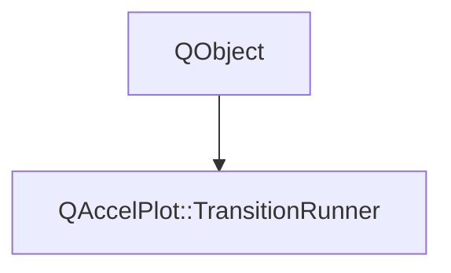

# Class QAccelPlot::TransitionRunner


[**ClassList**](annotated.md) **>** [**QAccelPlot**](namespaceQAccelPlot.md) **>** [**TransitionRunner**](classQAccelPlot_1_1TransitionRunner.md)


_Runs the_ `DataTransition` _assigned to one item, such as a custom series._[More...](#detailed-description)

* `#include <TransitionRunner.hpp>`


Inherits the following classes: QObject


## Inheritance diagram




## Public Signals

| Type | Name |
| ---: | :--- |
| signal void | [**frameDue**](classQAccelPlot_1_1TransitionRunner.md#signal-framedue)  <br>_Emitted once per rendered frame while the run is active._  |
| signal void | [**interrupted**](classQAccelPlot_1_1TransitionRunner.md#signal-interrupted)  <br>_Emitted when the run stopped before its end: the transition was replaced, cancelled, or destroyed._  |
| signal void | [**transitionDestroyed**](classQAccelPlot_1_1TransitionRunner.md#signal-transitiondestroyed)  <br>_Emitted after the assigned transition was destroyed, when_ `transition()` _is already_`nullptr` _._ |


## Public Functions

| Type | Name |
| ---: | :--- |
|   | [**TransitionRunner**](#function-transitionrunner) (QQuickItem \* item) <br>_Constructs the runner for_ _item_ _, which must outlive it._ |
|  bool | [**active**](#function-active) () const<br>_Returns_ `true` _while the transition advances the run._ |
|  bool | [**advance**](#function-advance) (std::vector&lt; double &gt; & outData, int & outPointCount) <br>_Writes the frame of the run into_ _outData_ _and__outPointCount_ _, or the target data when the run ends._ |
|  void | [**cancel**](#function-cancel) () <br>_Ends the run and discards its data._  |
|  bool | [**enabled**](#function-enabled) () const<br>_Returns_ `true` _when a transition is assigned and enabled, so new data should start a run._ |
|  bool | [**finish**](#function-finish) (std::vector&lt; double &gt; & outData, int & outPointCount) <br>_Ends the run and moves its target data into_ _outData_ _and__outPointCount_ _._ |
|  bool | [**pending**](#function-pending) () const<br>_Returns_ `true` _while the run holds target data that_`finish()` _has not taken._ |
|  bool | [**setTransition**](#function-settransition) ([**DataTransition**](classQAccelPlot_1_1DataTransition.md) \* transition) <br>_Assigns_ _transition_ _, interrupting a pending run first. The runner does not own it._ |
|  void | [**start**](#function-start) (const std::vector&lt; double &gt; & currentData, int currentPointCount, std::vector&lt; double &gt; && newData, int newPointCount, int stride=2) <br>_Starts the run on the assigned transition and requests a frame. Requires an assigned transition._  |
|  const std::vector&lt; double &gt; & | [**targetData**](#function-targetdata) () const<br>_Returns the target data. Valid while_ `pending()` _is_`true` _._ |
|  int | [**targetPointCount**](#function-targetpointcount) () const<br>_Returns the number of points in_ `targetData()` _._ |
|  [**DataTransition**](classQAccelPlot_1_1DataTransition.md) \* | [**transition**](#function-transition) () const<br>_Returns the assigned transition, or_ `nullptr` _._ |
|   | [**~TransitionRunner**](#function-transitionrunner) () override<br>_Ends the run without emitting_ `interrupted()` _._ |


## Detailed Description


Holds the item's `DataTransition::Run` and asks for a frame once per rendered frame while it is active. The request comes on the GUI thread from `QQuickWindow::afterAnimating`, before the scene graph syncs, so `DataTransition::runningChanged` reaches QML there and the frame renders the new step. `LineCurve` and `BarSeries` animate through it.


**
**


* Forward the item's `transition` property to `transition()` and `setTransition()`.
* When data arrives and `enabled()` is `true`, call `start()`; otherwise call `cancel()` and show the data.
* On `frameDue()`, call `advance()` and show the frame.
* On `interrupted()`, call `finish()` and show the target data.


Use it on the item's thread only.


**See also:** [**DataTransition**](classQAccelPlot_1_1DataTransition.md) 


    
## Public Signals Documentation


### signal frameDue {#signal-framedue}

_Emitted once per rendered frame while the run is active._ 
```C++
void QAccelPlot::TransitionRunner::frameDue;
```


<hr>


### signal interrupted {#signal-interrupted}

_Emitted when the run stopped before its end: the transition was replaced, cancelled, or destroyed._ 
```C++
void QAccelPlot::TransitionRunner::interrupted;
```


The run still holds the target data. A run still pending after the signal is cancelled. 


        

<hr>


### signal transitionDestroyed {#signal-transitiondestroyed}

_Emitted after the assigned transition was destroyed, when_ `transition()` _is already_`nullptr` _._
```C++
void QAccelPlot::TransitionRunner::transitionDestroyed;
```


<hr>
## Public Functions Documentation


### function TransitionRunner {#function-transitionrunner}

_Constructs the runner for_ _item_ _, which must outlive it._
```C++
explicit QAccelPlot::TransitionRunner::TransitionRunner (
    QQuickItem * item
) 
```


<hr>


### function active {#function-active}

_Returns_ `true` _while the transition advances the run._
```C++
bool QAccelPlot::TransitionRunner::active () const
```


<hr>


### function advance {#function-advance}

_Writes the frame of the run into_ _outData_ _and__outPointCount_ _, or the target data when the run ends._
```C++
bool QAccelPlot::TransitionRunner::advance (
    std::vector< double > & outData,
    int & outPointCount
) 
```


Call it from a `frameDue()` handler. 

**Returns:**

`true` if the run is still active after this call. 


        

<hr>


### function cancel {#function-cancel}

_Ends the run and discards its data._ 
```C++
void QAccelPlot::TransitionRunner::cancel () 
```


<hr>


### function enabled {#function-enabled}

_Returns_ `true` _when a transition is assigned and enabled, so new data should start a run._
```C++
bool QAccelPlot::TransitionRunner::enabled () const
```


<hr>


### function finish {#function-finish}

_Ends the run and moves its target data into_ _outData_ _and__outPointCount_ _._
```C++
bool QAccelPlot::TransitionRunner::finish (
    std::vector< double > & outData,
    int & outPointCount
) 
```


**Returns:**

`false`, leaving the outputs unchanged, when the run is not pending. 


        

<hr>


### function pending {#function-pending}

_Returns_ `true` _while the run holds target data that_`finish()` _has not taken._
```C++
bool QAccelPlot::TransitionRunner::pending () const
```


<hr>


### function setTransition {#function-settransition}

_Assigns_ _transition_ _, interrupting a pending run first. The runner does not own it._
```C++
bool QAccelPlot::TransitionRunner::setTransition (
    DataTransition * transition
) 
```


**Returns:**

`false` when _transition_ is already assigned. 


        

<hr>


### function start {#function-start}

_Starts the run on the assigned transition and requests a frame. Requires an assigned transition._ 
```C++
void QAccelPlot::TransitionRunner::start (
    const std::vector< double > & currentData,
    int currentPointCount,
    std::vector< double > && newData,
    int newPointCount,
    int stride=2
) 
```


**Parameters:**


* `currentData` Current double buffer (copied as the _from_ state). 
* `currentPointCount` Number of points in _currentData_. 
* `newData` Target double buffer (moved as the _to_ state). 
* `newPointCount` Number of points in _newData_. 
* `stride` Number of values per point in both buffers. Default: 2, XY points. 


        

<hr>


### function targetData {#function-targetdata}

_Returns the target data. Valid while_ `pending()` _is_`true` _._
```C++
const std::vector< double > & QAccelPlot::TransitionRunner::targetData () const
```


<hr>


### function targetPointCount {#function-targetpointcount}

_Returns the number of points in_ `targetData()` _._
```C++
int QAccelPlot::TransitionRunner::targetPointCount () const
```


<hr>


### function transition {#function-transition}

_Returns the assigned transition, or_ `nullptr` _._
```C++
DataTransition * QAccelPlot::TransitionRunner::transition () const
```


<hr>


### function ~TransitionRunner {#function-transitionrunner}

_Ends the run without emitting_ `interrupted()` _._
```C++
QAccelPlot::TransitionRunner::~TransitionRunner () override
```


<hr>

------------------------------
The documentation for this class was generated from the following file `QAccelPlot/src/QAccelPlot/transitions/TransitionRunner.hpp`

